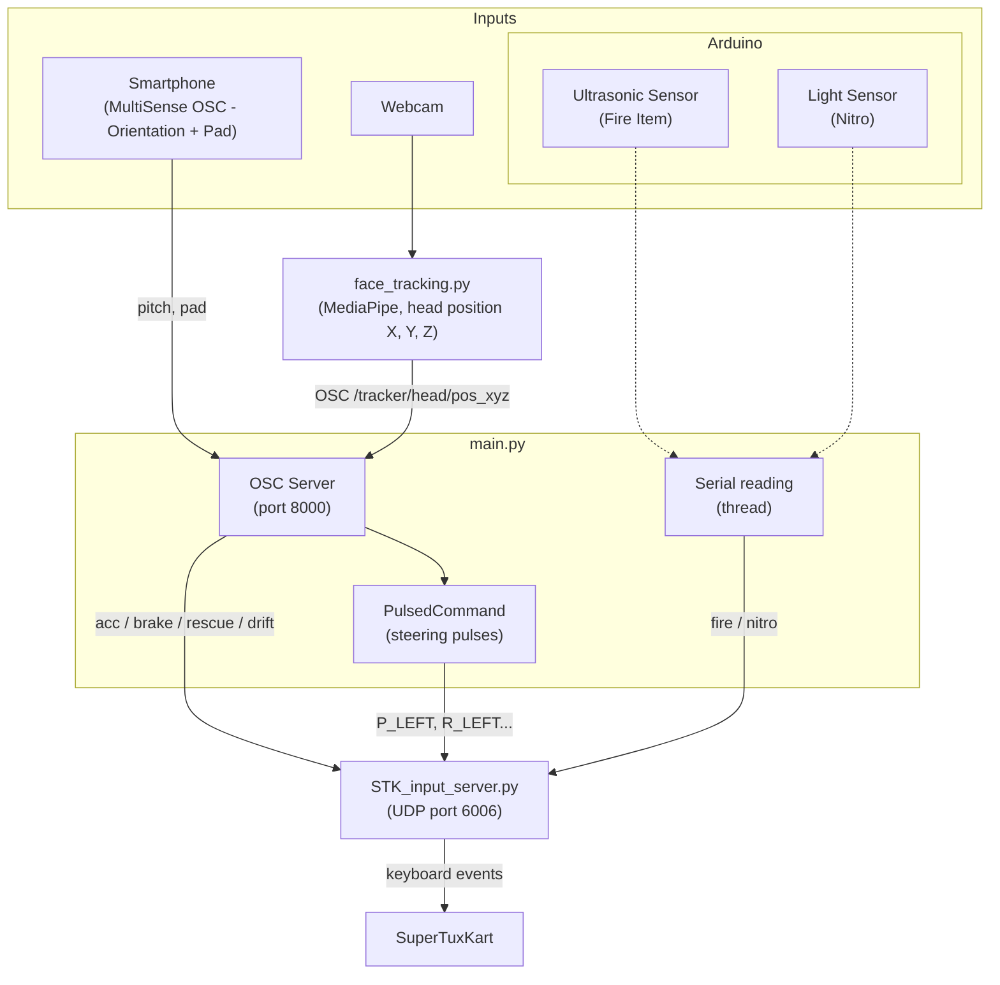
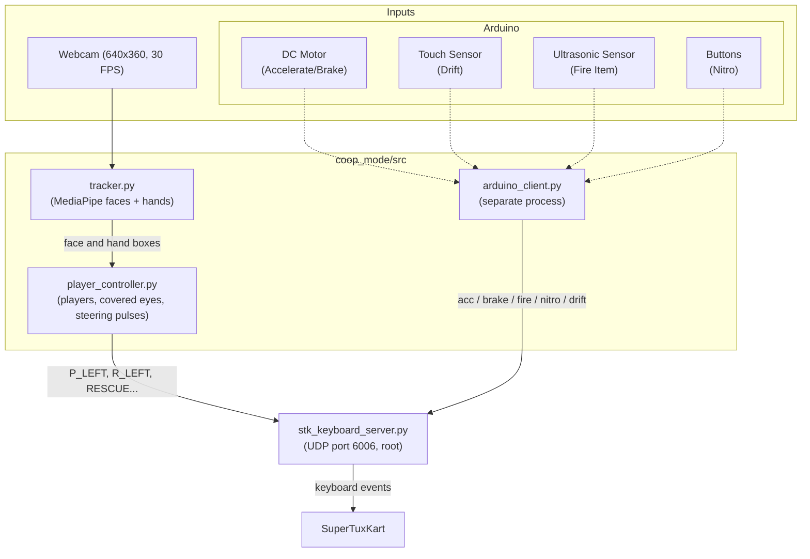

# SuperTuxKart Dual Controller System

> **Academic Project:** M2 SIIA – UE MCSI (2026-2027)

## 1. Project Summary
This is our final project for the M2 SIIA MCSI course. The goal was to build two new ways to control SuperTuxKart without using a standard keyboard or mouse to drive.

Both modes reuse what we built during the TPs (UDP server/client, OSC with the phone, continuous commands, head tracking with MediaPipe) and add new parts for the project, mainly the Arduino sensors and the multiplayer coop mode. Section 3 details what comes from each TP.

---

## 2. The Two Game Modes

We split the project into two separate modules: a Performance mode and a Collaboration mode.

### A. Performance Mode (`performance_mode/`)
One player, the goal is to drive fast and precisely.

- **Steering:** tilt the phone left / right (MultiSense OSC, orientation). The angle gives a value between 0 and 1, sent as pressed / released pulses (`PulsedCommand`), so the kart can turn more or less.
- **Accelerate / Brake:** horizontal position of the head, tracked with the webcam (`face_tracking.py`). The head in the center accelerates, leaning to one side brakes.
- **Rescue:** move the head very close to the camera.
- **Drift:** touch the Pad of MultiSense OSC.
- **Fire Item (Arduino):** put your hand in front of the ultrasonic sensor (less than 5 cm).
- **Nitro (Arduino):** cover the light sensor.



### B. Collaboration Mode (`coop_mode/`)
A co-op mode for 2 or 3 players in front of the webcam. Players have to coordinate because the driving tasks are split between them.

- **Steering (Camera):** players stand on the left and right sides of the webcam. The left player covers their eyes to steer left, and the right player covers their eyes to steer right.
- **Rescue:** all active players must cover their eyes at the same time to call the rescue bird.
- **Acceleration & Braking (Arduino):** one player turns a DC motor by hand. Forward to accelerate, backward to brake.
- **Fire Item (Arduino):** a mini basketball hoop with an ultrasonic sensor. You have to score a basket to fire an item.
- **Nitro (Arduino):** press 3 buttons the required number of times. When the 3 LEDs are on, a buzzer sounds and the nitro fires in-game.
- **Drift (Arduino):** touch sensor.

Press `2` or `3` in the video window to choose the number of players.



---

## 3. From the TPs to the Project

| TP | What we reused | Where in the project |
|---|---|---|
| TP0 | UDP server / client (`STK_input_server.py`, `STK_input_client.py`) | `performance_mode/STK_input_server.py` (server of the TP), `coop_mode/tools/stk_keyboard_server.py` (adapted), UDP clients in both modes |
| TP0 | OSC with MultiSense (`testOSC.py`, `bind()`) | OSC server in `performance_mode/main.py` |
| TP1 §2b | Steering with the phone orientation | `callback_pitch` in `performance_mode/main.py` |
| TP1 §4 | Continuous commands (pressed / released, times t1 and t2) | `PulsedCommand` in `performance_mode/main.py`, frame-based version in `coop_mode/src/core/player_controller.py` |
| TP2 | MediaPipe face detection, calibration, 3D head position, OSC sending | `performance_mode/face_tracking.py`, `coop_mode/src/vision/tracker.py` |
| TP2 | Hand tracking | `HandLandmarker` in `coop_mode/src/vision/tracker.py` |
| New | Arduino sensors, coop mode with 2-3 players, covering the eyes to steer | `*.ino`, `arduino_client.py`, `player_controller.py` |

The comments in the code also indicate which TP each part comes from.

---

## 4. Technical Details

- **Keyboard server:** on Linux, Wayland blocks background key inputs, so the coop mode sends its commands to `stk_keyboard_server.py`, which must be run with `sudo`. The performance mode uses the TP0 server.
- **Continuous commands:** steering keys are pressed and released quickly, and the time spent pressed depends on how much the player wants to turn (TP1 §4).
- **Vision:** face and hand detection use MediaPipe, as in TP2 (`blaze_face_short_range.tflite`). In the coop mode, each face box is averaged with the previous one to reduce jitter.
- **Camera (coop):** OpenCV uses MJPG at 640x360 to reach 30 FPS.
- **Arduino:** read in a separate thread (performance) or a separate process (coop), so the main loop never waits for the serial port.

---

## 5. Installation

We recommend using a Python virtual environment.

```bash
git clone https://github.com/Lucas-P-Souza/STK_controller.git
cd STK_controller

python3 -m venv venv
source venv/bin/activate

pip install -r requirements.txt
```

---

## 6. How to Run

### Coop Mode

Upload `coop_mode/setup2/setup2.ino` to the Arduino.

**Terminal 1**, keyboard server (root required):
```bash
sudo /path/to/your/venv/bin/python coop_mode/tools/stk_keyboard_server.py
```
Add `-d` to run in debug mode: the received commands are printed instead of pressing the keys.

**Terminal 2**, camera and game logic:
```bash
source venv/bin/activate
python3 coop_mode/src/main.py
```
This also starts the Arduino client in the background. Press `q` in the video window to quit.

### Performance Mode

Upload `performance_mode/lux/lux.ino` to the Arduino (it sends `distance,lux` lines), and set `SERIAL_PORT` at the top of `performance_mode/main.py` (for example `COM4` on Windows, `/dev/ttyACM0` on Linux).

1. Start the TP0 server:
   ```bash
   python performance_mode/STK_input_server.py
   ```
2. Start the main program:
   ```bash
   python performance_mode/main.py
   ```
3. On the phone, open MultiSense OSC, enter the IP of the computer and port `8000`, and enable **Orientation** and **PAD** (same setup as TP0).
4. Set `address` in `performance_mode/face_tracking.py` to the IP of the computer running `main.py`, then start the head tracking from the `performance_mode/` folder (the model file is loaded from there). The optional argument is your interpupillary distance in cm:
   ```bash
   cd performance_mode
   python face_tracking.py 6.2
   ```
