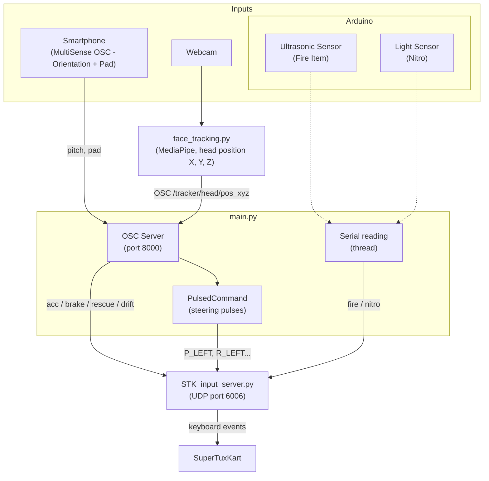
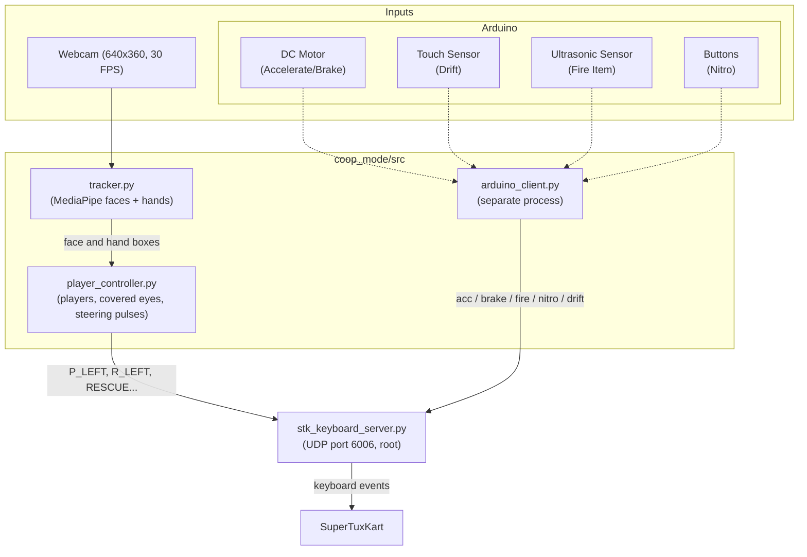

# SuperTuxKart Dual Controller System

> **Academic Project:** M2 SIIA – UE MCSI (2026-2027)

## 1. Project Summary
This is our final project for the M2 SIIA MCSI course. The goal was to build two new ways to control SuperTuxKart without using a standard keyboard or mouse to drive.

---

## 2. The Two Game Modes

We split the project into two separate modules: a Performance mode and a Collaboration mode.

### A. Performance Mode (`performance_mode/`)
One player, the goal is to drive fast and precisely.

- **Steering:** tilt the phone left / right (MultiSense OSC, orientation). The angle gives a value between 0 and 1, sent as pressed / released pulses (`PulsedCommand`), so the kart can turn more or less.
- **Accelerate / Brake:** horizontal position of the head, tracked with the webcam (`face_tracking.py`). The head in the center accelerates, leaning to one side brakes.
- **Rescue:** move the head very close to the camera.
- **Drift:** touch the Pad of MultiSense OSC.
- **Fire Item (Arduino):** put your hand in front of the ultrasonic sensor (less than 5 cm).
- **Nitro (Arduino):** cover the light sensor.



### B. Collaboration Mode (`coop_mode/`)
A co-op mode for 3 players in front of the webcam. Players have to coordinate because the driving tasks are split between them.

- **Steering (Camera):** players stand on the left and right sides of the webcam. The left player covers their eyes to steer left, and the right player covers their eyes to steer right.
- **Rescue:** all active players must cover their eyes at the same time to call the rescue bird.
- **Acceleration & Braking (Arduino):** one player turns a DC motor by hand. Forward to accelerate, backward to brake.
- **Fire Item (Arduino):** a mini basketball hoop with an ultrasonic sensor. You have to score a basket to fire an item.
- **Nitro (Arduino):** press 3 buttons the required number of times. When the 3 LEDs are on, a buzzer sounds and the nitro fires in-game.
- **Drift (Arduino):** touch sensor.

Press `2` or `3` in the video window to choose the number of players.



---

## 5. Installation

We recommend using a Python virtual environment.

```bash
git clone https://github.com/Lucas-P-Souza/STK_controller.git
cd STK_controller

python3 -m venv venv
source venv/bin/activate

pip install -r requirements.txt
```

---

## 6. How to Run (Coop Mode)

You need to run the keyboard server and the main vision loop at the same time in two different terminals.

### Step 1: Start the Emulation Server (Root required)

In **Terminal 1**:

```bash
# Make sure you use the python from your virtual environment
sudo /path/to/your/venv/bin/python coop_mode/tools/stk_keyboard_server.py
```

*(Tip: Add `-d` at the end to run in debug mode. It prints the received commands in the terminal instead of actually pressing physical keys).*

### Step 2: Start the Game Client

In **Terminal 2** (make sure your `venv` is activated):

```bash
source venv/bin/activate
python3 coop_mode/src/main.py
```

*Note: This will automatically start the webcam interface AND connect to the Arduino in the background. Press `q` in the video window to quit.*

---

## 7. Documentation

We made sure to document all the core Python modules and classes (like `PulsedCommand`, `VisionTracker`, etc.) using standard docstrings. Because of this, the technical documentation can be easily extracted using tools like Sphinx or pydoc.
