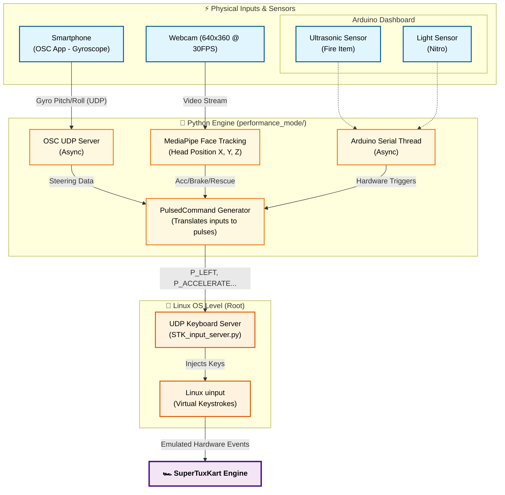
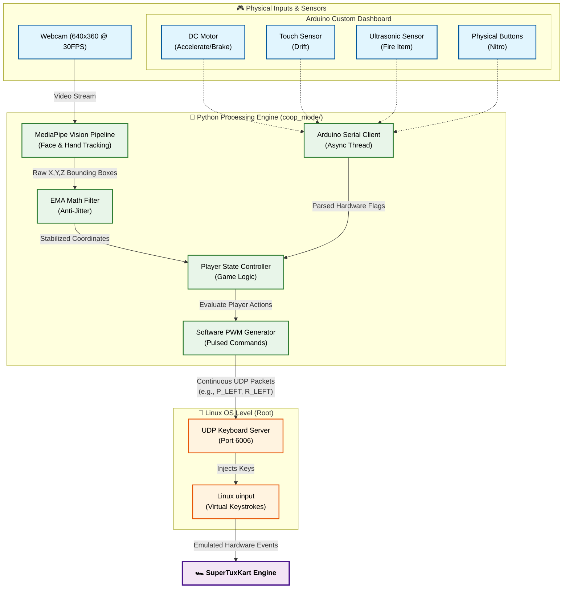

# SuperTuxKart Dual Controller System 🏎️💨

> **Academic Project:** M2 SIIA – UE MCSI (2025-2026)  

## 1. Project Summary
This is our final project for the M2 SIIA MCSI course. The goal was to build two new ways to control SuperTuxKart without using a standard keyboard or mouse to drive. 

To do this, we built a system that uses computer vision (MediaPipe) and hardware sensors (Arduino) to control the game. This architecture combines what we learned in the TPs (like OSC/UDP networking and basic computer vision) with concepts from our other engineering classes, such as Arduino serial communication and EMA signal filtering.

---

## 2. The Two Game Modes

We split the project into two separate modules to cover both the Performance and Collaboration requirements:

### A. Performance Mode (`performance_mode/`) ⏱️
*Goal: Fast, precise racing where every millisecond counts.*
- **How it works:** We wanted to drop all the heavy video processing to get the lowest latency possible. This mode relies entirely on OSC and Serial communication to make the controls super responsive.
- **Controls:** We use a smartphone's gyroscope (via OSC) for steering, face tracking for acceleration/braking, and Arduino sensors for firing items (ultrasonic sensor) and nitro (light sensor).



### B. Collaboration Mode (`coop_mode/`) 🤝
*Goal: A fun, chaotic co-op experience for 2 or 3 players.*
- **How it works:** We mixed AI body tracking with a custom physical dashboard. Players have to actually coordinate because the driving tasks are split between them.
- **Steering (Camera):** Players stand on the left and right sides of the webcam. The left player covers their eyes to steer left, and the right player covers their eyes to steer right.
- **Rescue (Lakitu):** True teamwork! All active players on camera must cover their eyes at the exact same time to call the rescue bird.
- **Acceleration & Braking (Arduino):** One player controls a physical DC motor generator. Spin it forward to accelerate, backward to brake. 
- **Fire Item (Arduino):** We set up a mini basketball hoop with an ultrasonic sensor. You have to physically score a basket to fire an item!
- **Nitro (Arduino):** A button-mashing minigame. You have to rapidly click 3 physical buttons. Once you hit the requirement and light up all 3 LEDs, a buzzer sounds and the nitro fires in-game.

---



## 3. How It Works Under the Hood ⚙️

One of our biggest hurdles was Wayland blocking background key inputs on Linux. To get around this, both modes send UDP packets to a custom root-level Python script (`stk_keyboard_server.py`) that injects inputs directly into the Linux OS.

- **Continuous Commands:** Our code doesn't just send single, choppy keypresses. We implemented software PWM (like in the `PulsedCommand` class) so we can send continuous, parallel commands without blocking the main loop.
- **Vision Pipeline:** Powered by Google's MediaPipe (`blaze_face_short_range.tflite`). We applied an Exponential Moving Average (EMA) mathematical filter to the bounding boxes to stop the steering from jittering.
- **Camera Setup:** We forced OpenCV to use MJPG hardware compression at 640x360. This saves USB bandwidth and guarantees a stable 30 FPS, while giving us a wide enough view to fit everyone on screen.
- **Arduino Client:** The Arduino runs asynchronously in a background thread, reading serial data and using internal pull-up resistors to avoid floating noise.

---

## 4. Prerequisites and Installation

We highly recommend using a Python virtual environment so you don't mess up your system's global packages with the computer vision libraries.

```bash
# Clone the repository and enter the directory
git clone <repo_url>
cd STK_controller

# Create a virtual environment and activate it
python3 -m venv venv
source venv/bin/activate

# Install dependencies
pip install -r requirements.txt
```

---

## 5. How to Run (Coop Mode)

You need to run the keyboard server and the main vision loop at the same time in two different terminals.

### Step 1: Start the Emulation Server (Root required)
In **Terminal 1**:
```bash
# Make sure you use the python from your virtual environment
sudo /path/to/your/venv/bin/python coop_mode/tools/stk_keyboard_server.py
```
*(Tip: Add `-d` at the end to run in debug mode. It prints the received commands in the terminal instead of actually pressing physical keys).*

### Step 2: Start the Game Client
In **Terminal 2** (make sure your `venv` is activated):
```bash
source venv/bin/activate
python3 coop_mode/src/main.py
```
*Note: This will automatically start the webcam interface AND connect to the Arduino in the background. Press `q` in the video window to quit.*

---

## 6. Documentation 📚

We made sure to document all the core Python modules and classes (like `PulsedCommand`, `VisionTracker`, etc.) using standard docstrings. Because of this, the technical documentation can be easily extracted using tools like Sphinx or pydoc.
